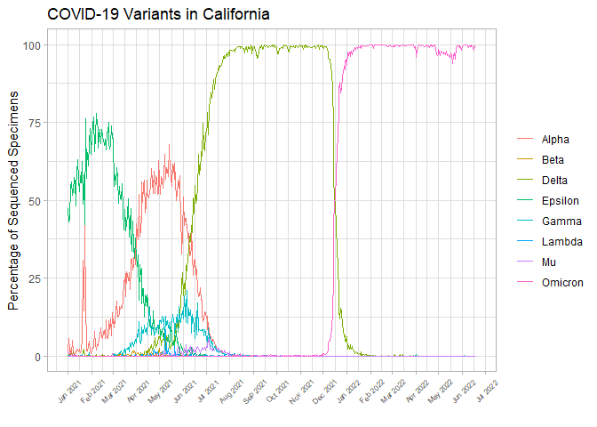

Bioinformatics_Exam_Q15
================
Galilea Guerrrero PID: A59010531
2022-07-13

Import data from the Human Services (CHHS) open data site:
<https://data.chhs.ca.gov/dataset/covid-19-variant-data> and loaded
required packages.

``` r
data <- read.csv("covid19_variants.csv")

library(ggplot2)
```

    ## Warning: package 'ggplot2' was built under R version 4.1.3

``` r
library(lubridate)
```

    ## 
    ## Attaching package: 'lubridate'

    ## The following objects are masked from 'package:base':
    ## 
    ##     date, intersect, setdiff, union

``` r
library(tidyverse)
```

    ## -- Attaching packages --------------------------------------- tidyverse 1.3.1 --

    ## v tibble  3.1.7     v dplyr   1.0.9
    ## v tidyr   1.2.0     v stringr 1.4.0
    ## v readr   2.1.2     v forcats 0.5.1
    ## v purrr   0.3.4

    ## Warning: package 'tibble' was built under R version 4.1.3

    ## Warning: package 'dplyr' was built under R version 4.1.3

    ## -- Conflicts ------------------------------------------ tidyverse_conflicts() --
    ## x lubridate::as.difftime() masks base::as.difftime()
    ## x lubridate::date()        masks base::date()
    ## x dplyr::filter()          masks stats::filter()
    ## x lubridate::intersect()   masks base::intersect()
    ## x dplyr::lag()             masks stats::lag()
    ## x lubridate::setdiff()     masks base::setdiff()
    ## x lubridate::union()       masks base::union()

Filtered data set to remove “Total” and “Other” data points from
variants.

``` r
data2 <- filter(data, variant_name != "Total")
head(data2)
```

    ##         date       area area_type variant_name specimens percentage
    ## 1 2021-01-01 California     State        Gamma         0       0.00
    ## 2 2021-01-01 California     State         Beta         0       0.00
    ## 3 2021-01-01 California     State       Lambda         0       0.00
    ## 4 2021-01-01 California     State        Alpha         1       1.69
    ## 5 2021-01-01 California     State      Epsilon        28      47.46
    ## 6 2021-01-01 California     State        Other        29      49.15
    ##   specimens_7d_avg percentage_7d_avg
    ## 1               NA                NA
    ## 2               NA                NA
    ## 3               NA                NA
    ## 4               NA                NA
    ## 5               NA                NA
    ## 6               NA                NA

``` r
data3 <- filter(data2, variant_name != "Other")
head(data3) 
```

    ##         date       area area_type variant_name specimens percentage
    ## 1 2021-01-01 California     State        Gamma         0       0.00
    ## 2 2021-01-01 California     State         Beta         0       0.00
    ## 3 2021-01-01 California     State       Lambda         0       0.00
    ## 4 2021-01-01 California     State        Alpha         1       1.69
    ## 5 2021-01-01 California     State      Epsilon        28      47.46
    ## 6 2021-01-01 California     State      Omicron         1       1.69
    ##   specimens_7d_avg percentage_7d_avg
    ## 1               NA                NA
    ## 2               NA                NA
    ## 3               NA                NA
    ## 4               NA                NA
    ## 5               NA                NA
    ## 6               NA                NA

Specify dates as a date variable.

``` r
data3$date <- ymd(data3$date)
```

Make a line plot with variants over time.

``` r
plot <- ggplot(data3) + aes(date, percentage, group=variant_name) + 
  geom_line(aes(color=variant_name)) + 
  ggtitle("COVID-19 Variants in California")+
  labs(x="", y="Percentage of Sequenced Specimens") +
  scale_x_date(date_breaks = "1 month", date_labels = "%b %Y")+
  scale_color_discrete(name="")

plot + theme_light() + theme(axis.text.x = element_text(size=6, vjust=0.5, angle=45)) 
```

<!-- -->

Final plot represents the prominence of COVID variants in California as
a percentage of sequenced specimens over time (January 2021-July 2022).

Alpha and Delta variants appear to become prominent in the population
rapidly and for a prolonged period of time.
